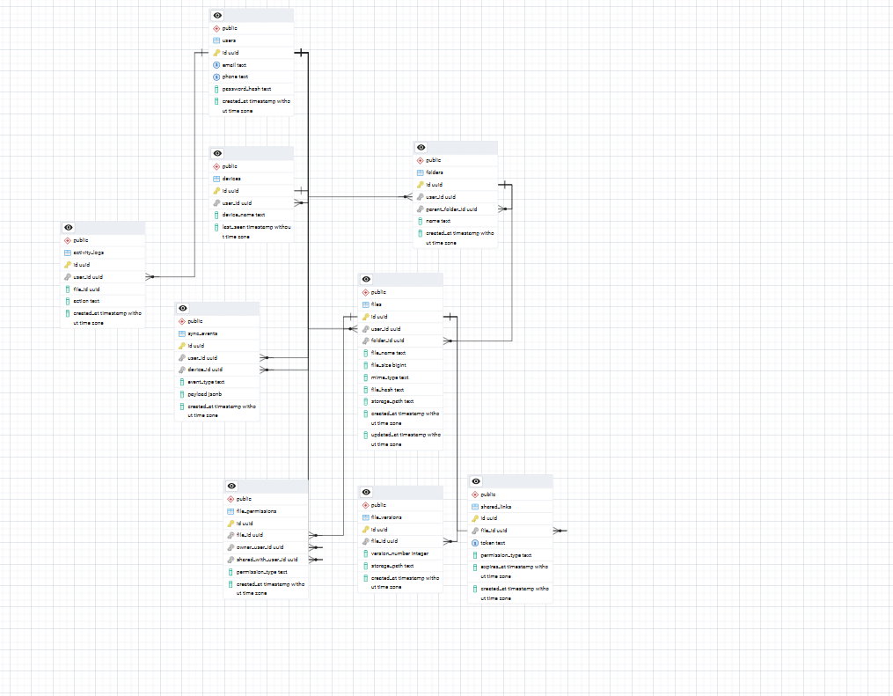

# Проектирование высоконагруженного облачного хранилища, аналога Google Disk
## 1. Тема и целевая аудитория
   ### 1.1 Описание сервиса
   Google disk - Облачное хранилище с масштабируемой инфрастуктурой, позволяющее загружать файлы в хранилище, открывать файлы редактировать файлы, синхронизировать доступ к ним, а также настраивать доступ к ним с любого устройства и передавать их.
   ### 1.2 Целевая аудитория
   * Количество пользователей в месяц(MAU): 2 млрд
   * Количество пользоватеелй в день(DAU): 400 млн
   * Географическое положение: Весь мир
   ### 1.3 Ключевой функционал сервиса (MVP)
   * Регистрация и аутентификация
   * Загрузка и скачивание файлов
   * Управление файловой структурой
   * Синхронизация метаданных между устройствами
   * Совместный доступ к файлам
   * История версий файлов
   * Предпросмотр популярных форматов
   ### Источники
   * https://developers.google.com/identity/protocols/oauth2
   * https://developers.google.com/drive/api/guides/share
   * https://developers.google.com/drive/api/guides/preview
## 2. Расчет нагрузки
   ### 2.1 Продуктовые метрики
| Метрика | Значение | Метод расчёта / Обоснование |
|---------|----------|----------------------------|
| **MAU** (Monthly Active Users) | `2 млрд` | Масштаб уровня Google (базовое допущение) |
| **DAU** (Daily Active Users) | `400 млн` | ~20% от MAU, типичный коэффициент вовлечённости |
| **Общее число файлов в системе** | `10 000 ПБ` (10 ЭБ) | `2 млрд пользователей × 5 ГБ/пользователь` |
| **Средний размер файла** | `5 МБ` | Учитывает преобладание документов, изображений и небольших видео |
| **Загрузки файлов в сутки** | `3 млрд` | `MAU × 1.5 загрузки/пользователь/сутки` |
| **Изменяемых файлов в сутки** | `800 млн` | `20% от DAU × 10 файлов/пользователь` |
| **Срок хранения неактивных данных** | `2 года` | Политика удаления аккаунтов при отсутствии активности |

 
   ### 2.2 Технические метрики
   #### Расчёт объёма хранения
| Тип данных | Расчёт | Итоговый объём |
|------------|--------|----------------|
| Пользовательские файлы | 2 млрд × 5 ГБ | 10 000 ПБ (10 ЭБ) |
| Метаданные файлов | 3 трлн файлов × 2 КБ | ~6 ПБ |
| История версий файлов | 10 000 ПБ × 20% | ~2 000 ПБ |
| Превью файлов (thumbnails / previews) | 3 трлн × 200 КБ | ~600 ПБ |
| Сервис регистрации и аутентификации | 2 млрд × 1,5 КБ | ~3 ТБ |
| Сессии пользователей | 400 млн × 3 устройства × 512 Б | ~614 ГБ |

   #### Расчет RPS
### Расчёт RPS

| Тип запроса | Общее кол-во запросов в сутки | Средний RPS (÷ 86400) | Пиковый RPS (×3) |
|------------|-------------------------------|------------------------|------------------|
| Загрузка файлов | 3 000 000 000 | 34 722 | 104 166 |
| Скачивание / просмотр файлов | 5 000 000 000 | 57 870 | 173 610 |
| Операции с метаданными (поиск, листинг, rename) | 8 000 000 000 | 92 592 | 277 776 |
| Синхронизация устройств | 2 500 000 000 | 28 935 | 86 805 |
| Регистрация / аутентификация | 666 666 | 7.7 | 23 |
| **Итого** | **18.5 млрд** | **214 126** | **642 380** |

   #### Сетевой трафик
| Тип трафика | Объём в сутки | Средний трафик (Гбит/с) | Пиковый (×3) |
|-------------|--------------|--------------------------|--------------|
| Загрузка файлов | ~15 000 ТБ | ~1 389 | ~4 167 |
| Скачивание / просмотр | ~25 000 ТБ | ~2 315 | ~6 945 |
| Метаданные API | ~16 ТБ | ~1.48 | ~4.44 |
| Синхронизация | ~25 ТБ | ~2.31 | ~6.93 |
| Регистрация / auth | ~0.03 ТБ | ~0.0003 | ~0.0009 |
| **Итого** | **~40 041 ТБ** | **~3 708 Гбит/с** | **~11 124 Гбит/с** |

## 3. Глобальная балансировка нагрузки
   ### 3.1 Функциональное разбиение по доменам

При анализе архитектуры Google Drive выделены следующие ключевые домены:

| Домен | Назначение | Примечание |
|-------|------------|------------|
| `drive.google.com` | Основной веб-интерфейс для работы с файлами, папками и настройками через браузер | Фронтенд + API Gateway для пользовательских операций |
| `docs.google.com` | Сервис для создания и редактирования документов, таблиц и презентаций | Выделен в отдельный поддомен для независимого масштабирования редакторов и real-time коллаборации |
| `googleapis.com/drive/v3` | Публичный REST API для интеграций | Используется сторонними приложениями, мобильными клиентами и автоматизацией |

 🔗 **Источники:**
   *https://developers.google.com/identity/protocols/oauth2
   *https://developers.google.com/drive/api/guides/share
   *https://developers.google.com/drive/api/guides/preview
   ### 3.2 Расположение дата-центров
Для обеспечения глобального покрытия с минимальной задержкой и соответствия требованиям локального законодательства
о локализации данных сервис использует распределённую инфраструктуру дата-центров, сгруппированную по географическим
регионам. 
В Северной Америке, которая обрабатывает около 35% мирового трафика,
развёрнуты три ключевых узла: us-east1 в Северной Вирджинии (США) служит крупнейшим хабом восточного побережья 
с низкой задержкой для населения США и Канады, us-west1 в Орегоне обеспечивает покрытие западного побережья
и резервирование для восточного региона, а us-central1 в Айове используется для балансировки нагрузки
и экономичного хранения «холодных» данных. Европейский регион, обрабатывающий порядка 30% трафика, 
представлен тремя локациями: europe-west1 в Бельгии выступает основным хабом для Западной Европы с высокой 
связностью, europe-west3 во Франкфурте (Германия) является ключевым узлом для соблюдения требований GDPR и 
локализации данных пользователей из Евросоюза, а europe-west2 в Лондоне обеспечивает покрытие Великобритании
и Ирландии с учётом независимой юридической юрисдикции. Для покрытия Азиатско-Тихоокеанского региона 
(~25% трафика) используются дата-центры в Сингапуре (asia-southeast1), который служит главным хабом 
для Юго-Восточной Азии и связан десятками подводных оптоволоконных магистралей с Европой,
Ближним Востоком и Австралией, в Токио (asia-northeast1) для работы с пользователями Японии
и Южной Кореи с учётом локальных требований к персональным данным, а также на Тайване (asia-east1)
в качестве дополнительного узла повышения отказоустойчивости. 
Оставшиеся 10% трафика из регионов «Остальной мир» обслуживаются через southamerica-east1 в Сан-Паулу 
(Бразилия) для покрытия Латинской Америки с соблюдением местного законодательства LGPD и australia-southeast1
в Сиднее для Австралии, Новой Зеландии и Океании. Выбор каждой локации обусловлен четырьмя ключевыми критериями:
обеспечением задержки не более 50 мс для 95% целевой аудитории, возможностью хранения данных в пределах 
юрисдикции пользователя для соответствия регуляторным требованиям (GDPR, 152-ФЗ, LGPD и др.), 
наличием множественных независимых подводных и наземных каналов связи для устранения единых точек отказа,
а также доступом к стабильным источникам энергии и системам охлаждения для гарантированного выполнения
SLA на уровне 99,99%.

### Источники
   *https://datacenters.google/locations/
   ### 3.3 Распределение запросов по ДЦ
   * Северная Америка ( 45% )
   * Европа ( 30% )
   * Азия ( 20% )
   * Остальной мир ( 5% )
   ### 3.4 Схема DNS балансировки
Пользователь → Запрос к https://drive.google.com/
→ Anycast DNS
→ Определение ближайшего региона по IP
→ DNS Response с IP ближайшего Edge/DC
→ Edge Load Balancer
→ Backend Cluster
→ Object Storage / Metadata Services

   ### 3.5 Схема Anycast
   *Сервис использует Anycast-сеть, при которой один и тот же IP-адрес анонсируется одновременно из нескольких дата-центров через BGP.## 4. Локальная балансировка нагрузки
   ### 4.1 Схема балансировки
   *Для обеспечения высокой отказоустойчивости и обработки большого количества одновременных подключений используется двухуровневая схема балансировки нагрузки.
   ### L4 балансировщик:
   *На транспортном уровне используется Linux Virtual Server (LVS).   * Least connection смотрит, на список подключений и выбирает менее загруженный.
   ### L7 балансировщики (Nginx):
   Занимаются SSL Termination и отправляют запросы на бэкенды по http уже.  
## 5. Логическая схема БД
   ### 5.1 Схема БД
     

  
      

 
## 6. Физическая схема БД
   ### 6.1 Распределение таблиц по базам данных
   
   | База данных | Тип | Назначение | Таблицы                                                                          |
   |-------------|-----|------------|----------------------------------------------------------------------------------|
   | **PostgreSQL (OLTP)** | Реляционная, ACID | Основные транзакционные данные пользователей и файловой системы | `users`, `folders`, `files`, `permissions`, `subscriptions`.`devices`,`sessions` |
   | **Cassandra** | NoSQL, Wide-Column | Хранение истории изменений и событий синхронизации с высокой нагрузкой на запись | `file_versions`, `sync_events`,`activity_logs`                                   |
   | **Redis** | In-Memory Key-Value | Кеш frequently-used metadata, пользовательские сессии, rate limiting| `user_sessions`, `file_metadata_cache`, `share_links_cache`                      |
   | **ClickHouse** | Колоночная OLAP | Аналитика, DWH, статистика использования сервиса | `storage_usage_stat`,`download_stats`, `traffic_events`,  `audit_logs`           |
   | **S3 / Object Storage** | Объектное хранилище | Хранение бинарных файлов пользователей, preview и thumbnails | `user_files`, `file_previews`,`thumbnails`,`backup_objects`                                      |

   ### 6.2 Индексы

| Таблица | Состав индекса | Тип индекса | Назначение / Пояснение |
|---------|---------------|-------------|------------------------|
| **users** | • `email` • `phone` • `id` | • UNIQUE B-Tree • UNIQUE B-Tree • PRIMARY KEY B-Tree | Поиск при аутентификации; обеспечение уникальности `email` и `phone` |
| **user_sessions** | • `token` • `user_id, expires_at` • `expires_at` | • UNIQUE B-Tree • Composite B-Tree • B-Tree | Проверка сессии по токену; получение активных сессий пользователя; фоновая очистка просроченных сессий |
| **files** | • `owner_user_id` • `parent_folder_id, file_name` • `file_hash` • `updated_at` | • B-Tree • Composite B-Tree • HASH / B-Tree • B-Tree | Получение файлов пользователя; поиск внутри папки; дедупликация по хешу; сортировка по времени изменения |
| **folders** | • `owner_user_id` • `parent_folder_id` • `folder_name, parent_folder_id` | • B-Tree • B-Tree • Composite B-Tree | Навигация по древовидной структуре; поиск папок по имени в контексте родителя |
| **permissions** | • `file_id, user_id` • `shared_link_token` • `user_id, permission_type` | • Composite B-Tree • UNIQUE B-Tree • Composite B-Tree | Проверка прав доступа к файлу; доступ по публичной ссылке; получение списка расшаренных файлов |
| **file_versions** | • `file_id, version_number` • `created_at` | • Composite B-Tree • B-Tree | Получение истории версий файла; откат к конкретной версии по номеру или дате |
| **sync_events** *(Cassandra)* | • `(device_id), event_timestamp` | • Compound Primary Key Partition: `device_id` | Локализация событий синхронизации одного устройства на одном шарде для быстрого чтения |
| **activity_logs** *(Cassandra)* | • `(user_id), created_at` | • Compound Primary Key Partition: `user_id` | Хранение аудита действий пользователя; быстрое получение истории по `user_id` |
| **subscriptions** | • `user_id, status` • `end_date` | • Composite B-Tree • B-Tree | Проверка активной подписки; фоновая обработка истекающих тарифов |
| **devices** | • `user_id` • `device_uuid` | • B-Tree • UNIQUE B-Tree | Получение списка устройств пользователя; идентификация клиента при синхронизации |
   ### 6.3 Шардирование
| СУБД | Таблица | Ключ шардирования | Пояснение |
|------|---------|-------------------|-----------|
| **PostgreSQL** | `users` | `id` | Все операции пользователя выполняются в контексте `user_id`, что позволяет локализовать данные пользователя на одном шарде |
| **PostgreSQL** | `folders` | `owner_user_id` | Папки пользователя логически связаны с владельцем, что упрощает навигацию по файловой структуре |
| **PostgreSQL** | `files` | `owner_user_id` | Большинство запросов к файлам выполняется от имени владельца, что уменьшает межшардовые JOIN |
| **PostgreSQL** | `permissions` | `file_id` | Права доступа всегда запрашиваются в контексте конкретного файла |
| **PostgreSQL** | `subscriptions` | `user_id` | Подписки пользователя хранятся на том же шарде, что и профиль пользователя |
| **Cassandra** | `file_versions` | `file_id` | Все версии одного файла хранятся на одном узле, что ускоряет получение истории изменений |
| **Cassandra** | `sync_events` | `device_id` | События синхронизации одного устройства локализованы на одном шарде |
| **Cassandra** | `activity_logs` | `user_id` | История действий пользователя хранится на одном узле для быстрого получения audit log |
| **Redis** | `user_sessions` | `token` | Сессии распределяются равномерно по токену, проверка выполняется на одном Redis-узле |
| **Redis** | `file_metadata_cache` | `file_id` | Кеш metadata файлов шардируется по `file_id` для равномерного распределения нагрузки |
| **Redis** | `share_links_cache` | `shared_link_token` | Публичные ссылки равномерно распределяются между Redis-узлами |
| **S3 / Object Storage** | `user_files` | `object_id` | Файлы распределяются по object_id/hash-префиксам для равномерной загрузки storage-нод |
   ### 6.4 Резервирование
| СУБД | Схема | Пояснение |
|------|-------|-----------|
| **PostgreSQL** | Master + 2 replicas (1 synchronous, 1 asynchronous) | Все записи выполняются в master. Чтения могут выполняться с реплик. Синхронная реплика подтверждает запись до ответа клиенту, асинхронная используется для масштабирования чтения |
| **Cassandra** | Masterless, Replication Factor = 3, consistency = QUORUM | Данные автоматически реплицируются между узлами. Запись считается успешной при подтверждении большинством реплик (QUORUM), что обеспечивает баланс между доступностью и консистентностью |
| **Redis** | Redis Cluster (master-replica per shard) | Каждый шард имеет master и replica. При отказе master происходит автоматический failover на replica, что обеспечивает высокую доступность кэша и сессий |
| **S3 / Object Storage** | Multi-region replication (georeplication) | Объекты синхронно/асинхронно реплицируются между регионами. При отказе одного датацентра данные доступны из другого региона без потери файлов |
   
   ### 6.5 Библиотеки для работы с БД

   | СУБД | Библиотека |
   |------|------------|
   | PostgreSQL | pgx |
   | Cassandra | gocql | 
   | Redis | go-redis |
   | ClickHouse | clickhouse-go |
   | S3 | minio-go |

## 7. Алгоритмы

### 7.1 Фрагментация и загрузка файлов (Chunk Upload)

Для поддержки загрузки больших файлов используется разбиение файла на чанки фиксированного размера (8–16 MB).

**Алгоритм работы:**
- файл делится на блоки (chunks);
- каждый chunk загружается независимо;
- сервер собирает файл по `chunk_id`;
- при ошибке повторно загружаются только недостающие части.

**Преимущества:**
- устойчивость к обрывам соединения;
- параллельная загрузка;
- снижение нагрузки на сеть.

---

### 7.2 Дедупликация файлов

Используется контентная адресация для уменьшения объёма хранения.

**Алгоритм:**
- вычисляется хеш файла (SHA-256);
- если файл с таким хешем уже существует — новый объект не создаётся;
- пользователю создаётся ссылка на существующий файл.

**Преимущества:**
- экономия дискового пространства;
- ускорение загрузки;
- устранение дубликатов.

---

### 7.3 Синхронизация устройств

Система поддерживает синхронизацию между несколькими устройствами пользователя.

**Алгоритм:**
- изменения файлов формируют event;
- события сохраняются в очередь изменений;
- клиент получает обновления через polling или push;
- локальное состояние обновляется по полученным изменениям.

**Поддерживаемые операции:**
- создание / удаление файла;
- переименование;
- перемещение;
- изменение содержимого.

---

### 7.4 Версионирование файлов

Каждое изменение файла создаёт новую версию.

**Механизм:**
- версии связаны цепочкой (version chain);
- каждая версия хранит ссылку на предыдущую;
- поддерживается rollback на любую версию;
- возможна оптимизация через delta encoding.

---

### 7.5 Поиск файлов

Гибридный поиск по метаданным:

- индексирование в PostgreSQL;
- full-text search по имени и тегам;
- кеширование популярных запросов в Redis.

---

### 7.6 Предпросмотр файлов

Генерация preview для ускоренного отображения:

- изображения → thumbnails;
- PDF → постраничный рендер;
- видео → keyframe-превью.

Генерация выполняется асинхронно background-воркерами.
## 8. Технологии

| Технология | Область применения | Обоснование выбора |
|------------|--------------------|---------------------|
| Go | Backend | Низкое потребление памяти, высокая конкурентность (goroutines), подходит для высоконагруженного I/O (загрузка/скачивание файлов) |
| Python | Backend (background jobs, processing) | Удобен для сервисов обработки файлов, генерации preview и интеграций |
| FastAPI | API сервисы | Высокая производительность, поддержка async, удобная работа с REST |
| TypeScript + React | Frontend | Удобная разработка SPA, строгая типизация и масштабируемость UI |
| NGINX | L7 балансировка, reverse proxy | SSL termination, проксирование, кеширование статики |
| gRPC | Внутренние сервисы | Быстрое бинарное взаимодействие между микросервисами, Protobuf |
| OpenAPI / Swagger | Документация API | Стандарт для описания REST API и генерации клиентов |
| PostgreSQL | Основная OLTP БД | Надёжные ACID транзакции для пользователей, файлов и прав доступа |
| Apache Cassandra | High-load storage | Хранение событий (версии файлов, синхронизация), высокая запись |
| Redis | Кеширование и сессии | In-memory скорость, хранение сессий и metadata cache |
| S3 / Object Storage | Хранение файлов | Надёжное и дешёвое хранение больших бинарных объектов |
| ClickHouse | Аналитика | Быстрые агрегации и аналитика по логам и использованию системы |
| Cloudflare | CDN, DNS, DDoS protection | Anycast сеть, защита и ускорение доступа пользователей |
| Docker | Контейнеризация | Единое окружение для разработки и продакшена |
| Kubernetes | Оркестрация | Автоскейлинг, отказоустойчивость, управление микросервисами |
| Helm | Deployment management | Управление конфигурациями Kubernetes окружений |
| Prometheus | Метрики | Сбор системных и бизнес метрик |
| Grafana | Визуализация | Дашборды состояния системы |
| Jaeger | Distributed tracing | Отслеживание запросов между сервисами |
| GitHub Actions | CI/CD | Автоматизация тестов, сборки и деплоя |
| Testify (Go) | Unit-тесты | Удобные инструменты тестирования backend логики |
| Pytest | Тестирование Python | Основной фреймворк для тестов сервисов обработки |
| Testcontainers | Интеграционные тесты | Запуск реальных зависимостей (DB, Redis) в Docker для тестов |
